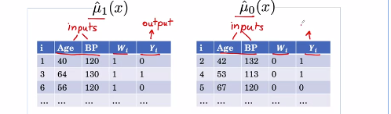
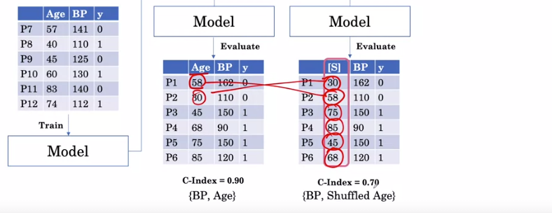
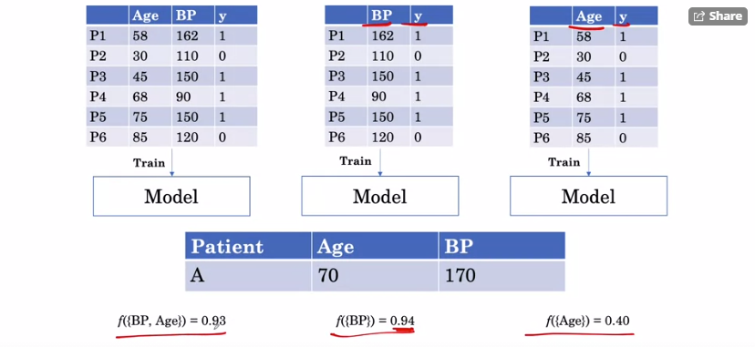

# Coursera: AI for Medical Treatment
Summarize, assignment (Jupyter notebook), labs (Jupyter Notebook) from the Coursera's AI for Medical Course.

# Table of Contents

# Key Concepts
## Week 1:

### Randomized Control Trials

### Absolute Risk Reduction (ARR)
We separate the patient into 2 groups: treatment and no treatment (placebo). After 1 year, we record the result. 

We express the result as the absolute risk (AR). We can quantify the treatment effect as the different in absolute risk between 2 groups, called ARR. 

### Randomly Assigned the patients
Randomized control trial (RCT) to ensure that the result aren't biased by the patient's demographic. The patient in both group are similar (same distribution)

### Significant Testing (p-value)
p-value < 0.01 means that there is less than 0.1% probability that we would observe the difference in risk of 0.03 or more if the treatment actually have zero effect. => Statistically Significant. 

### Number Needed to Treat
- Number of people who need to receive the treatment in order to benefit one of them. 
- NNT = 1/ARR

### Causal Inference
- Question: what is the effect of a treatment on a patient? 
  
  

#### In the ideal world where each patient have two outcomes.
The effect of the treatment might be different in each patients. We can classify the outcome into 3 different effect: Benefit / No effect / Harm. This result can be represent as Neyman-Rubin causal model. We are interested in the level treatment effect (difference) $Y_i(1) - Y_i(0)$.

We can calculate the average treatment effect

#### In reality, 
- Each patient is either receive treatment or doesn't receive treatment.
- How do we estimate average treatment effect (ATE)? Via randomized controlled trials! Here the ATE value is -0.19.
  
    
    

- Note that the ATE value is closely related to ARR.

#### Conditional Average Treatment Effect
Can we make a more individualized estimate? E.g. given a patient is 56 years old, can we get a more individualized estimate of their benefit based on this age. Yes!! We can subset the interested group from the data. 

However, this way we might not have enough information and, hence, the result can't be trusted. So, we can do this via base learner. 

#### Base model: T-Learner

The base learner could be any models. We just need to train it like a normal regression model. Assume we use the decision tree as our base model with two tree model.  (T-Learner)

T-Learner has less data than S-Learner to train the individual model. However, for S-Learner, it is possible to get the 0 treatment effect. 

#### Base Model: S-Learner
Assume we use the decision tree as our base model with two tree model.  T-Learner

### Evaluate Individualized Treatment Effect

To compare we would need to know the Y(0) but Y(0) is unknown for this patient. There are two ways: similar features or similar ITE estimate with Y(0) = 1. 

Once we found the match pair, we can get the 
- average ITE estimate
- $Y(1) - Y(0)$ : observed benefit/harm/no-effect
  

#### C-for-benefit (similar to C-index)
We can compute whether the higher predicted benefit actually corresponds to a higher observed benefit using a method called the c-for-benefit. 
- Concordant Pair: the pair with the higher number for the estimate has the higher outcome. As a translation, this means that for the matched pair that we predict would benefit more from the treatment, it actually has the better outcome.
    
    

- Non concordant pair:  the pair with the higher estimate number has the lower outcome level. This means that for the matched pair that we predict would benefit more from the treatment actually has the worst outcome.

    

- Risk Tie: 
  
  

- Permissible pair: different outcome.
- Tie in outcome: same outcome. We can't use them because we don't know which pair should have a higher score. 

- Example (Manual Calculation):
    
    
    

#### C-for-benefit: Calculation
1. Split the data into 2 groups: treatment and no-treatment. Get ITE via S-learner or T-learner

    

2. Sort by ITE (the largest ITE on top)
    
    

3. Match by Rank: 
   - $YD = Y(1)_{left} - Y(0)_{right}$
   - $TE = average(ITE_{left}, ITE_{right})$

    

4. Calculate C-index

    

So what does a C-for-benefit of 0.60 mean? The C-for-benefit means that given two randomly chosen pairs, A and B with different outcomes, what is the probability that the pair with the greater treatment effect estimate also has the greater Y diff? With 0.60, it means that the probability that the model correctly identifies the patient pair with the greater treatment benefit is 60 percent.

*** 

## Week 2: NLP 

### BERT / ELMo / XLNet: Contextualized work representation
Unlike the non-contextualized word representation such as word2vec, Glove. 
Here we use BERT For medical question answering:

High level overview:
- Input: Question and  Passage
- Output: the answer to the question which is the segment of the passage.
- Tokenize the word: *Separator*, a special token that separate the question and passage. 
    
    

- Each word is passed through multiple Transformer Block to retrieve vector representation.
    
     

- How BERY learn the word contextualized representation? Words from passage were passed to the BERT model. One of the word is masked. Then, the output predict the probability of all the words in the vocabulary. The process allows BERT to learn to predict the MASK correctly and obtain the word embedding in second picture.  
    
    

- BioBERT from medical train on the medical document.
   
    

- The output: the output can be defined by two token, start and end. The goal of the model is to learn which one of the word should be "start" and "end".
    
    

    The model determine the word whether it is likely to be a "start" or "end" word by learning two vectors S and E (same dimension as the word embedding). Each word representation is multiply with vector S and E. The higher the score, the more likely it is to be the start or end of the answer. 
    
    

    Creating the grid from the start and end score to determine which word is the most likely answer. Each grid is the sum of the start score and End score for each combination, E.g. P => by = -4.1 + (-4.3) = -8.4. The highest score is 8.2 (reduce => level)

    

    The model learn different vector S and E. 
    

### Extracting the label from the report
- Supervised Learning: BERT
    
    

- Unsupervised Learning: 2 steps extracting label from the report
  - Step 1: Is an observation mentioned? Example: pneunomia? Searching the term or its synonym in the report. Example: lesion? The list of synonym can be obtain from Expert or Thesaurus or Vocabularies.
    
    
    
    
    SNOMED CT: synonym and relationship library. 

    
    

  - Step 2: Is the observation present or absent?
    - In the first step, we determine whether the term exist. Now, we need to ensure that it is a No or Yes for each term. E.g. the term Edema could be mentioned in the report but it could say "No Edema".
  
       

    - Create rule via 
      - Regex or dependency parse rules (unsupervised), such as "No ......", "Without ...." 
      - Build Negation Classifier (supervised)
        
        

### Evaluating the label extraction
- Ground truth is needed (from expert)
- Use Precision / Recall / F1 to evaluate our model. 

    
    
    F1 is using the harmonic mean which is useful for finding the average of rate of changes, e.g average speed. 
    
    
    
    Concept of precision is similar to PPV / Recall => Sensitivity / F1 => Dice Coefficient Score.
    
    

- Precision of all classes: 
  - Option 1: compute for each class and average it (Macro Average). If we want to ensure that the system is working well across all classes.
    
    

  - Option 2: Calculate it globally (Micro Average)

    

## Week 3:

### Feature Importance

#### Drop Column method
We can determine how important age was, or BP was, by looking at the difference in the performance of the model with and without the age feature. 
- So we take the difference in the C-index, 0.90 and 0.82, to get a difference of 0.08. 
- the importance for blood pressure, BP, we look at the difference in the model that uses both features versus one that doesn't include BP to get 0.90 minus, this time, 0.85, and find that that the difference is 0.05. 
- We're able to realize that age has higher feature importance than blood pressure.
- Con: we have to build so many models. 
   
    
    

#### Permutation Method
we see what is the drop in the performance of the model when we feed in the shuffled column to the model. 

- if a particular feature is important than we'd expect when we shuffle that column we see a huge drop in performance
- age is more important than blood pressure

#### Feature Importance for each individual

Question: For patient A, We want to know how important the blood pressure was for the prediction of the model on patient A.
- This particular patient has a blood pressure which is very high. So we might expect that although age is in general more important on this particular patient, their blood pressure would be driving their risk. S

The prediction using the BP is similar to the prediction made by the full model, but the prediction made with just age is much smaller.
-  the importance of BP is much higher for this patient than the importance of age. 
  

- **CON**: this method can fail to recognize important features when there are correlated features. For example, sBP is highly correlated with dBP, one of the two blood pressure measurements is always in the feature set, so we always see a high prediction of risk.
    
    

#### Shapley Values: overcome the correlated varaibles
It consider all possible subset, not just 1 pair. Let's say we are interested in sBP, we would have {Age, dBP, sBP} vs {Age, dBP} but for Shapley:

Now, we can get a single number of important of sBP: 

- Step1: consider number of ways that 3 features can be ordered. For each of these we can compute the importance of sBP against the features that appear before it. For example in {sBP, Age,  dBP} and {sBP, Age,  dBP}, sBP appears before both age and dBP. So we compute the output of the model with sBP only- the model with the empty set and take the difference.
  - {Age, dBP, sBP}
  - {Age, sBP,  dBP} 
  - {sBP, Age,  dBP}
  - ​{dBP, Age, sBP} 
  - {dBP, sBP,  Age} 
  - {sBP, dBP,  Age}

- Step2: We take an average of these differences. 

Notice that the contributions of sBP and dBP look much higher relative to age and before, and this is capturing that these two high values are driving the risk for this patient.

Shapley values are telling us how much each feature contributes to the additional risk over the baseline risk of the population.

#### Shapley Plot:
Example 2:Patient B

So we can visualize the Shapley values and their total using a force plot. On a force plot, we have the 
- output value of 0.26 and 
- the base value of 0.00. 

And this distance is going to be covered by the sum of these three Shapley values. So we can see that 
- the contribution of dBP is 0.01, small segment on the left
- The greatest contribution, of course, is by sBP which is a contribution of 0.3 in the positive direction, and 
- the contribution of age is -0.05. Now age is forcing the output in the lower direction, so it's blue. 
- sBP and dBP are forcing it in the positive direction, so they are red.

#### Shapley Value from all patients (distribution)
The distribution of Shapley values for all patients. 
- we can see that the age feature has large positive and negative importance values for many patients in this dataset. 
- we can color the points in the summary plot based on the feature value. 
  - Red here is a high feature value, which means that when a point is red for age, this means that a patient is old. 
  - A Blue point is when the feature value is low. For age, this means that a patient is young. 
  - For age is that age is important and contributing to an increased risk when the patient is old. Age is also important as a feature and contributing to decreased risk when the patient is young. 

#### Shapley Value from all patients (Bar Plot)
We compute the overall importance by taking the absolute value of the Shapley values for all patients and then taking the average of those Shapley values for each of the features. So that way we get the average of the absolute value of the Shapley values and are able to say that age is the most important feature

#### Shapley: SHAP
There are newer extensions and implementations of Shapley values like SHAP, which don't require retraining of these models and can perform these computation of the Shapley values efficiently.

### Interpreting CNN Models

#### Recap on CNN (ResNet-34):  

 It's generally believed that the early layers in a CNN capture low-level features while the later layers capture higher level visual information that is relevant to the task.

 The output of the last conv layer is flattened and then passed to one or more of these fully connected layers to give the output,  here of cardiomegaly with 80% probability. 
 
 Once the features are flattened, the spatial information is lost. So if we want to visualize the features the model has picked up in our image, we want to visualize the features **before the flattening happens** (to get the spatial maps).

#### Localization Mapping

These spatial maps are typically much smaller in size than the input, typically between 7 by 7 and 14 by 14, varying according to the choice of architecture and the size of our input. 

The third dimension here is the number of spatial maps that are output by the last layer, which differ based on the architecture. 

#### K-spatial maps to a Heat Map
How we can go from these k spatial maps of size 10 by 10 to a heat map over the whole image?

- Step 1: Unpack the spatial maps. We denote the k spatial maps (plane) as $A_1, A_2, ..., A_k$.

- Step 2: Weighted Sum, We weight each of these plane with a weight given by *a*, and add all these up to get a localization map L for the output. $a_k$ here tells us the influence of each spatial map on the localization map.

    

#### Computing the weights, $a_k$.

we wanted to know **the influence of each feature (element) within the A_1 spatial map** on the output. 
1. Consider $A^1$ spatial map.
2. $A^1$ has 49 $(7 \times 7)$ elements or features. 
3. y represent the outputs core of the network for cardiomegaly right before the sigmoid activation. 
4. Computing the influence of each features in the spatial map on the output y by computing the partial derivative of y with respect to each feature in A_1. 
    $$\frac{\partial y}{\partial A^1_{ij}}$$ 
    This gives us a matrix telling us the influence of each feature on the output.
5. Example, for the 4 four values we see here: 
   1. The feature at position 2,2 is having the **greatest positive influence** on the output, because this number is the highest of all numbers.
   2. The feature at position 1,2 is having the **greatest negative influence** on the output of these values.
6. Getting the average influence of the spatial map $A_1$ on the output by taking the average of the feature influences at each of these positions.

The average influence can then be used as the weight we're seeking for the spatial map, $a_k$ in computing the localization map.

#### Creating the Heat Maps

Applying the ReLU function to L to make sure that the element in L matrix is non-negative. 

 we can visualize it using a heat map. A heat map is generated using a color map that translates numbers into color. The more positive numbers are going to appear bright and the numbers close to zero appear black.

#### Combining heatmap with input
we want to get the overlay which shows us where the model is looking to make a particular decision

1. Resize (Interpolation): The heat map is generated at a low resolution because it's the same size as the spatial map which we saw earlier was 10 by 10. We usually have to resize it and usually have some kind of interpolation to fill in the gaps when we resize to bring it up to the size of the x-ray image. 

2. Overlaying the resized heat map on the original image. Sometimes transparency is added to the heat map, sometimes proportional to the score for the class such that the heat map is brighter when the score is higher and less otherwise. 
   
    

#### For multiple class
 If the model has multiple possible output classes as your model for chest x-ray classification does, there is a different heat map you would want per disease.
 
 The GradCam can thus be extended to any class C by using that particular score for that class $y^C$ to get weights for that particular class aC, which in turn produces last specific heat maps.

# Assignment Overview

## Assignment 1:

## Assignment 2:

## Assignment 3:

# Labs